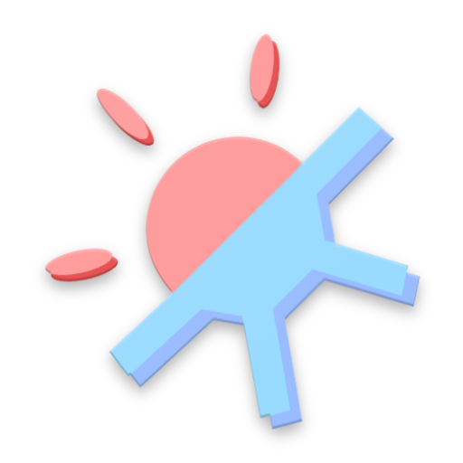

  

# PantsOrShorts
Should you wear pants or shorts today...? We got you covered!

## Full Description
Tells you whether you should wear pants or shorts today based on the local weather. Continuously learns from your preferences.

## Download on Google Play
[Download app here](https://play.google.com/store/apps/details?id=com.cobresun.brun.pantsorshorts). 

## Official iOS Port 
[PantsOrShorts-iOS Repository](https://github.com/Cobresun/PantsOrShorts-iOS)
